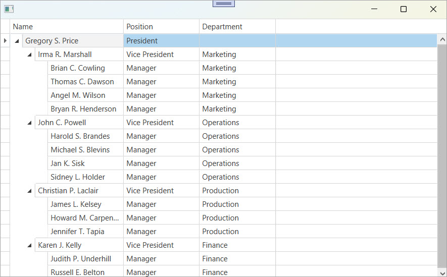

<!-- default badges list -->

[](https://supportcenter.devexpress.com/ticket/details/E3921)
[](https://docs.devexpress.com/GeneralInformation/403183)
[](#does-this-example-address-your-development-requirementsobjectives)
<!-- default badges end -->

# WPF Data Grid – Handle Drag & Drop Operations

This example enables drag & drop in the [`GridControl`](https://docs.devexpress.com/WPF/DevExpress.Xpf.Grid.GridControl) with a [`TreeListView`](https://docs.devexpress.com/WPF/DevExpress.Xpf.Grid.TreeListView). After a user drops a record, the grid updates  **Position** and **Department** fields of moved employees to match the target record. If the drop position is **Inside**, the grid clears the **Position** field.



Use this technique when you need to:

* Match record fields to the drop target.
* Apply custom rules on drop.
* Use hierarchical drag & drop in a `TreeListView`.

## Implementation Details

### Grid Setup

```xaml
<dxg:GridControl SelectionMode="Row" AutoGenerateColumns="AddNew">
  <dxg:GridControl.View>
    <dxg:TreeListView
      KeyFieldName="ID"
      ParentFieldName="ParentID"
      AutoExpandAllNodes="True"
      AllowDragDrop="True"
      DropRecord="OnDropRecord"/>
  </dxg:GridControl.View>
</dxg:GridControl>
```

### Custom Drop Logic

1. Retrieve dragged records from `e.Data` as [`RecordDragDropData`](https://docs.devexpress.com/WPF/DevExpress.Xpf.Core.RecordDragDropData).
2. Assign **Position** and **Department** values from the target record to dragged employees.
3. If `e.DropPosition == DropPosition.Inside`, clear the **Position** field.

```csharp
void OnDropRecord(object sender, DropRecordEventArgs e) {
    var data = (RecordDragDropData)e.Data.GetData(typeof(RecordDragDropData));
    var target = (Employee)e.TargetRecord;

    foreach (Employee employee in data.Records) {
        employee.Position = target.Position;
        employee.Department = target.Department;
    }

    if (e.DropPosition == DropPosition.Inside) {
        foreach (Employee employee in data.Records)
            employee.Position = string.Empty;
    }
}
```

### Data Source

Specify the data source when the window initializes:

```csharp
gridControl.ItemsSource = Staff.GetStaff();
```

## Files to Review

* [MainWindow.xaml](./CS/MainWindow.xaml) (VB: [MainWindow.xaml](./VB/MainWindow.xaml))
* [MainWindow.xaml.cs](./CS/MainWindow.xaml.cs) (VB: [MainWindow.xaml.vb](./VB/MainWindow.xaml.vb))

## Documentation

* [GridControl](https://docs.devexpress.com/WPF/DevExpress.Xpf.Grid.GridControl)
* [TreeListView](https://docs.devexpress.com/WPF/DevExpress.Xpf.Grid.TreeListView)
* [Drag & Drop Options](https://docs.devexpress.com/WPF/119241/controls-and-libraries/data-grid/drag-and-drop/drag-and-drop-options)
* [Process Drag & Drop Operations](https://docs.devexpress.com/WPF/400431/controls-and-libraries/data-grid/drag-and-drop/process-drag-and-drop-operations)
* [Drag & Drop](https://docs.devexpress.com/WPF/11346/controls-and-libraries/data-grid/drag-and-drop)

## More Examples

* [Implement CRUD Operations in the WPF Data Grid](https://github.com/DevExpress-Examples/wpf-data-grid-implement-crud-operations)
* [WPF Grid - Resize Rows Using a Splitter](https://github.com/sergepilipchuk/wpf-grid-resize-rows-using-splitter)
* [WPF Data Grid - Specify Custom Content for Headers Displayed in the Column Chooser](https://github.com/DevExpress-Examples/wpf-data-grid-custom-content-for-column-chooser-headers)
* [WPF Data Grid - Bind to Dynamic Data](https://github.com/DevExpress-Examples/wpf-bind-gridcontrol-to-dynamic-data)
* [WPF Grid (TreeListView) - Sync TreeListNode Expansion with ViewModel](https://github.com/DevExpress-Examples/wpf-grid-sync-isnodeexpanded-with-view-model)

<!-- feedback -->
## Does this example address your development requirements/objectives?

[](https://www.devexpress.com/support/examples/survey.xml?utm_source=github&utm_campaign=wpf-grid-handle-drag-and-drop&~~~was_helpful=yes) [](https://www.devexpress.com/support/examples/survey.xml?utm_source=github&utm_campaign=wpf-grid-handle-drag-and-drop&~~~was_helpful=no)

(you will be redirected to DevExpress.com to submit your response)
<!-- feedback end -->
